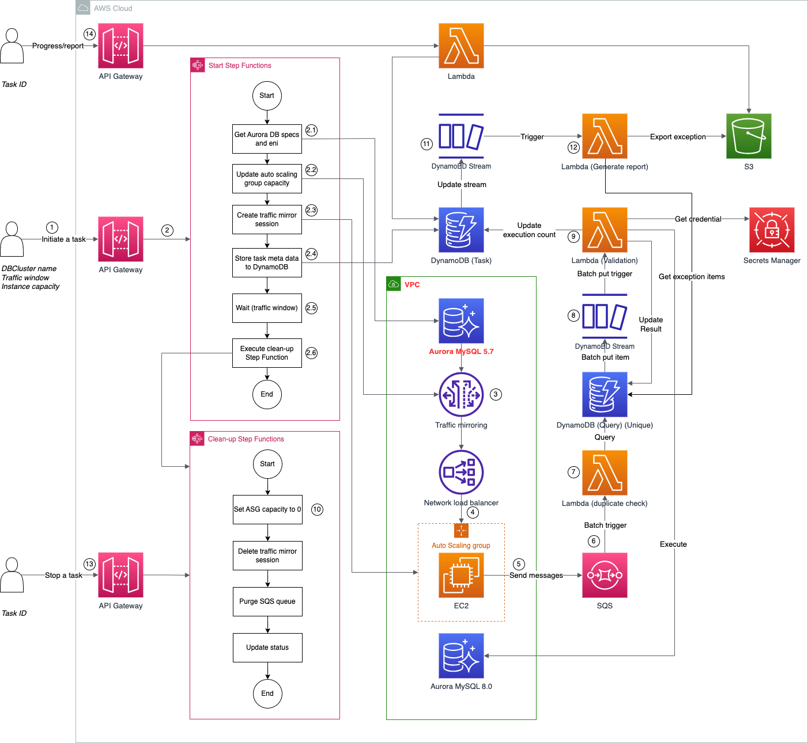

# queries-compatibility-check

本项目在进行Aurora MySQL 5.7到8.0的业务SQL语句的语法兼容性检查时，将使用VPC traffic mirroring进行数据库流量（业务SQL语句）的采集， 在采集到某段时间内在Aurora MySQL 5.7上执行的业务SQL语句之后，我们会使用关键字和STATEMENT_DIGEST_TEXT方法来进行语法兼容性检查。


### 架构图



### 部署文档

#### 前提条件

* 确定需要部署的VPC，被监控的Aurora数据库必须在同一个VPC下，记录下VPC ID，作为参数<VPC ID>。
* 在检测流量兼容性时，我们需要启动一台MySQL 8.0的Aurora数据库，所以需要准备至少两个私有子网ID，作为参数<private subnets ID>，使用英文逗号分隔。
* 在采集流量的时候，我们需要部署一些agent EC2实例，这些EC2实例需要部署在至少一个公有子网中，该公有子网应该有至少100个剩余IP，这个公有子网的IP作为参数<public subnets ID>，如果多于一个公有子网，使用英文逗号进行分隔。
* 一个Keypair，用于ssh本账号本区域下的Linux服务器，这个Keypair的名字作为参数<keypair name>。
* 最后，作为部署人员，需要至少有权限部署CDK代码，并且使用Cloudshell服务。


#### 部署步骤

在AWS console中搜索Cloudshell服务，或者打开cloudshell console：
以新加坡region为例：
https://ap-southeast-1.console.aws.amazon.com/cloudshell/home?region=ap-southeast-1

```shell
git clone https://github.com/aws-samples/queries-compatibility-check.git

cd queries-compatibility-check

pip3 install -r requirements.txt

# Install requirements for lambda layer
cd infrastructure/query_validation/lambda_function/
mkdir -p lambda_layer/python && cd lambda_layer/python/
pip3 install -t . pymysql

# Go back to folder queries-compatibility-check/
cd infrastructure/query_collection/lambda_function/
mkdir -p lambda_layer/dnspython/python && cd lambda_layer/dnspython/python
pip3 install -t . dnspython

# Go back to folder queries-compatibility-check/
cdk bootstrap -c env=<environment name> \
-c vpc=<VPC ID> \
-c private_subnets=<private subnets ID> \
-c public_subnets=<public subnets ID> \
-c keypair=<Keypair name>

# Example: cdk deploy -c env=dt \
# -c vpc=vpc-0b217a017fa41dedb 
# -c private_subnets=subnet-0dadd45276ef33efc,subnet-01ab09023c8403e03\
# -c public_subnets=subnet-090b3b480c87e8c56 
# -c keypair=dt-deploy

cdk deploy -c env=<environment name> \
-c vpc=<VPC ID> \
-c private_subnets=<private subnets ID> \
-c public_subnets=<public subnets ID> \
-c keypair=<Keypair name> 
```
部署完成之后，您可以参考以下接口使用说使用。

### 接口使用说明

本方案共实现了3个接口：启动检查任务接口；查看任务进度和报告接口；停止任务接口。
API example: https://8xxxx.execute-api.ap-southeast-1.amazonaws.com/prod/task
在使用该接口时， 需要在Headers中传入x-api-key， 对应的value 在AWS console API Gateway服务中，在左侧API Keys中，找到您对应的API key 复制即可。


#### 启动检查任务接口：POST

Request body:
```json
{
    "cluster_identifier": "string",
    "traffic_window": 2
}
```


cluster_identifier为数据库identifier。traffic_window为流量采集时长，单位为小时。

Response:
```json
{
    "task_id": "string",
    "message": "string"
}
```

task_id是这次任务的唯一编号，其他的接口需要传入此id进行针对一次检查任务的操作。message是报错信息，默认为空。

查看任务进度和报告接口：GET

Request：

?task_id=xxxx

Response, Response的内容与task的status有关 :
```json
{
    "message": "",
    "status": "Finished", # Created，In progress，Finished，Stopped, Error
    "captured_query": 134, # 抓取到的query数量
    "checked_query": 3, # 已完成检查的query数量
    "failed_query": 2, # 出错的query数量
    "created_time": "2024-03-29T07:39:34.354Z",
    "traffic_window": 1,
    "complete_percentage": "100%", # 已经过去的时间/采集的总时间 * 100%
    "start_capture_time": "2024-03-29T07:40:58.354Z", # 开始采集第一批query的时间
    "end_time": "2024-03-29T08:39:50.354Z", # 任务结束/停止时间
    "report_s3_presign_url":"presign_url_you_can_open_to_download_the_file", # 报告的下载链接
    "report_s3_uri": "s3://bucket_name/failed_reports/task_id/failed_queries.csv" # 报告的S3 URI
}
```


强行停止任务接口：PUT

Request body:
```json
{
    "task_id": "string"
}
```

task_id是这次任务的唯一编号。

Response:
```json
{
    "message": "string"
}

```
message是报错信息，默认为空。


### Legal
During the deployment, you will install software dnspython on the Lambda function layer. The software packages and/or sources you will install will be from the Amazon Linux distribution, as well as from third party sites. Below is the list of such third party software, the source link, and the license link for each software. Please review and decide your comfort with installing these before continuing.

#### dnspython (https://www.dnspython.org/)
Source: https://github.com/rthalley/dnspython
License: https://dnspython.readthedocs.io/en/stable/license.html

#### pymysql (https://pypi.org/project/pymysql/)
Source: https://github.com/PyMySQL/PyMySQL
License: https://pypi.org/project/pymysql/

Enjoy!
